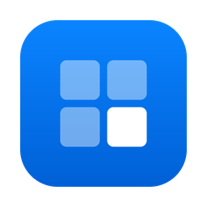
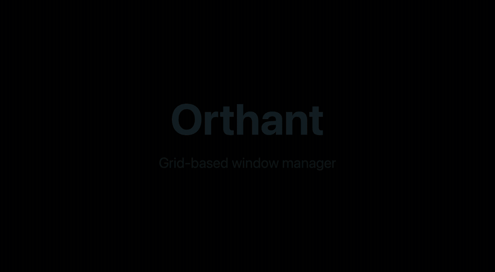

<div align="center">
  
  <h1>Orthant</h1>
  <p><strong>Grid-based window manager for macOS.</strong><br>
  Snap the frontmost window with keyboard shortcuts, or summon a grid and draw exactly where it should go.</p>
  <p>
    
    
    <a href="https://github.com/orthant-app/orthant/actions/workflows/ci.yml"></a>
  </p>
</div>

<p align="center">
  
</p>

## Install

```sh
brew install --cask orthant-app/tap/orthant
```

Or grab the `.dmg` from [the latest release](https://github.com/orthant-app/orthant/releases/latest) and drag Orthant to Applications. Either way you get the same build: signed with an Apple Developer ID and notarized by Apple, so it opens without a trip through System Settings. You can also [build from source](#build-from-source).

Orthant checks for updates on its own and installs them in place, so `brew upgrade` has nothing to do.

## What it does

Orthant lives in the menu bar (no Dock icon) and moves the window you were just using, without ever stealing focus from it. The target window is captured *before* any Orthant UI appears, so the app you're arranging stays frontmost throughout.

Two ways to place a window:

- **Direct shortcuts.** Halves, quarters, maximize, center, each on its own chord. Press `⌃⌥→` and the window fills the right half of its display. Instant.
- **The grid overlay.** Press `⌃⌥O` and a translucent grid appears over every display in about 50 ms. Drag across cells (or arrow around, with `⇧` to extend) and the selection previews exactly where the window will land. Release or `↩` places it, `Esc` cancels.

And it grows with you:

- **Custom regions.** Draw any block on a grid of your own choosing ("left ⅔"), name it, give it a shortcut. A region remembers its own proportions, so changing the overlay's grid size later never moves your windows.
- **`⌘S` on the overlay** saves the selection you just made as a region, pre-named and ready to bind.
- **Every shortcut is rebindable**, including the overlay summon. Conflicts aren't refused or silently stolen: the pane names the current owner, asks, and leaves an Undo.
- **Settings that stick.** Grid size (2–12 per axis), gaps between windows, launch at login. Everything survives a relaunch, and grid and gaps have a live preview.
- **Multi-display aware.** Windows snap within their *own* display, not the cursor's, mixed-DPI arrangements included.
- **Keyboard-first and accessible.** The whole app is keyboard-drivable, and the settings window is labelled for VoiceOver.

## Default shortcuts

| Action | Default |
| --- | --- |
| Left / right half | `⌃⌥←` · `⌃⌥→` |
| Top / bottom half | `⌃⌥↑` · `⌃⌥↓` |
| Quarters | `⌃⌥U` `⌃⌥I` `⌃⌥J` `⌃⌥K` |
| Maximize | `⌃⌥↩` |
| Center | `⌃⌥C` |
| Summon the grid overlay | `⌃⌥O` |

On the overlay: **drag** (or **arrow keys**, `⇧` to extend) to select, `↩` to place, `⌘S` to save the selection as a custom region, `Esc` to dismiss.

All of these are rebindable in **Settings → Shortcuts**. (`⌃` Control, `⌥` Option, `⇧` Shift, `⌘` Command, `↩` Return.)

## Platforms

| Platform | Status |
| --- | --- |
| **macOS 13+** | Works today |
| **Windows** | Planned: the same Dart UI over a pure-Dart Win32 backend, behind the same `WindowController` seam |
| **Linux** | Not possible: Wayland doesn't let one app move another's windows, by design |

## Permissions

**Accessibility permission** is the one thing Orthant asks for. It positions other apps' windows through the macOS Accessibility API, the same mechanism every window manager uses, and macOS gates that behind **System Settings ▸ Privacy & Security ▸ Accessibility**. On first launch Orthant walks you through granting it, and gets out of the way the moment it's on.

> [!TIP]
> **Why isn't this on the Mac App Store?** The Accessibility API doesn't work from inside the App Sandbox, and the store requires the sandbox. That rules it out permanently, for Orthant and every app in this category.

## Build from source

Prerequisites: [Flutter](https://flutter.dev) 3.35+ (stable channel) and a recent Xcode. Native dependencies resolve through Swift Package Manager, so there's no CocoaPods to install.

```sh
git clone https://github.com/orthant-app/orthant.git
cd orthant
flutter pub get
tool/dev_signing.sh setup    # once per machine, see below
tool/run_dev.sh              # build, sign, and launch the menu-bar app
```

> [!IMPORTANT]
> **Run `tool/dev_signing.sh setup` before your first build.** macOS ties the Accessibility grant to an app's *code signature*, and Flutter re-signs debug builds ad-hoc, differently every build. Without a stable identity, each rebuild orphans the grant and leaves the baffling state where System Settings shows Orthant **on** while the app insists permission is missing. The script creates one long-lived local signing certificate so the grant survives rebuilds (`tool/dev_signing.sh remove` undoes it).

Two more dev-loop notes:

- Use `tool/run_dev.sh`, **not** `flutter run -d macos`, for manual testing: a menu-bar app whose stdin isn't a TTY gets killed seconds after launch.
- If a grant ever wedges anyway: `tccutil reset Accessibility app.orthant.orthant`, then relaunch and re-grant. If the Accessibility row shows a stale name or icon, select it and remove it with **−** first.

## Architecture

Shared **Flutter/Dart** UI over a thin **Swift** native core, behind a single platform-agnostic `WindowController` seam:

```text
lib/
  core/         WindowController seam, grid geometry, channel adapter (pure Dart)
  overlay/      grid overlay UI + selection model (runs on a second Flutter engine)
  shortcuts/    commands, bindings, custom regions, persistence, hotkey service
  settings/     settings window, panes, macOS design tokens
  permission/   Accessibility state + onboarding
  app/          coordinator that wires it all together
macos/Runner/   Swift core: WindowControl (AX), HotkeyManager (Carbon hotkeys),
                OverlayPanel/OverlaySet (non-activating panels), AppShell,
                LoginItem (SMAppService), Updater (Sparkle)
test/           Dart unit + widget tests
tool/           run_dev.sh, dev_signing.sh, release.sh, reset_state.sh, make_app_icon.py
```

The choices that matter:

- **One coordinate system.** All window geometry is top-left-origin global points (the Accessibility/CoreGraphics space), converted from AppKit's bottom-left space exactly once, natively. Mixing the two spaces is the classic correctness bug in this category of app.
- **The overlay is a non-activating `NSPanel`** on a second, resident Flutter engine. It appears without Orthant ever becoming the frontmost app, and idles at 0% CPU while hidden.
- **Native handles never cross the platform channel.** Only plain data does, which is what keeps a second backend practical: the planned **Windows** port (pure-Dart Win32) implements the same `WindowController` seam behind the same UI. **Linux** isn't possible: Wayland doesn't let one app move another's windows, by design.

## Testing

```sh
flutter test        # Dart suite
flutter analyze
cd macos && xcodebuild test -workspace Runner.xcworkspace -scheme Runner \
  -configuration Debug -destination 'platform=macOS'   # native unit tests
```

The Dart side (geometry, bindings, regions, coordinator, overlay model) is developed test-first. The native AX/AppKit layer can't be exercised headlessly, so it's verified by scripted and manual acceptance against real windows on real displays.

## Uninstall

```sh
brew uninstall --zap orthant
```

`--zap` is the complete removal: it also clears Orthant's preferences, caches and saved state, and revokes its Accessibility grant. A plain `brew uninstall` leaves those behind.

Installed by hand instead? Quit Orthant and delete the app. Settings live in `~/Library/Preferences/app.orthant.orthant.plist`, and the Accessibility entry can be removed in System Settings ▸ Privacy & Security ▸ Accessibility.

## Name

An **orthant** is the n-dimensional generalization of a quadrant, which is what you get when a grid meets a screen.

## License

[MIT](LICENSE) © Optimal One
